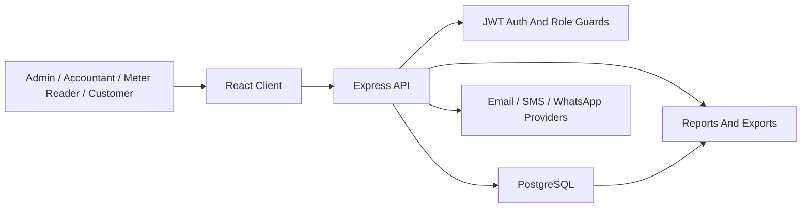

# System Architecture Overview

AGUA Global is a full-stack water utility operations system for customer management, meter readings, billing, collections, reporting, production monitoring, maintenance, payroll, and customer self-service.

## Technology Stack

- Frontend: React with Vite
- Backend: Node.js with Express
- Database: PostgreSQL
- Authentication: JWT bearer tokens
- Charts: Recharts
- Deployment target: Vercel for client and API, with a managed PostgreSQL database

## High-Level Architecture

## Application Layers

Frontend:

- Located in `client/`.
- Provides operational pages for dashboard, customers, readings, bills, payments, reports, production, payroll, communications, maintenance, and portal access.
- Uses `VITE_API_URL` to call the backend API.

Backend:

- Located in `server/`.
- Express app mounted in `server/src/app.js`.
- API route groups are under `server/src/routes/`.
- Controllers contain business logic under `server/src/controllers/`.
- Shared services support document delivery, SMS, WhatsApp, email, and utility behavior.

Database:

- Main schema lives in `server/database/schema.sql`.
- Incremental migrations live in `server/database/migrations/`.
- Seed data lives in `server/database/seed.sql`.

## Main Modules

- Authentication and users
- Customers, rates, zones, and account closure
- Meters, meter replacements, and meter readings
- Billing periods, bills, penalties, waivers, and source billing review
- Payments, allocations, receipts, suspense, and payment imports
- Expenses and operational cost tracking
- Maintenance requests and maintenance-linked expenses
- Customer portal
- Dashboard and reports
- Production source meters, weekly production readings, and electricity top-ups
- Payroll payees, payroll runs, approvals, and expense posting
- Communications, invoice alerts, campaigns, reusable templates, and delivery logs
- Audit trail

## Security Model

- All operational API routes require authentication unless explicitly public.
- Role authorization is handled at the route layer.
- Customer accounts are restricted to `/api/portal` and their own statement/payment surfaces.
- Admin-only routes include user management, backup report, some review actions, business settings updates, and destructive/high-risk operations.

## Key Deployment Shape

Recommended production topology:

- One Vercel project for `client/`.
- One Vercel project for `server/`.
- One managed PostgreSQL database.
- Provider credentials stored in Vercel environment variables.
- `CLIENT_ORIGIN` on the API must match the deployed frontend origin.
- `VITE_API_URL` on the client must point to the deployed API `/api` base URL.
