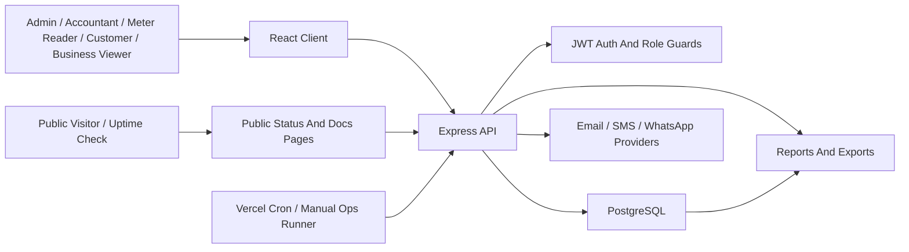

# System Architecture Overview

AGUA Global is a full-stack water utility operations system for customer management, meter readings, billing, collections, reporting, production monitoring, maintenance, payroll, controlled documentation, operational reminders, application monitoring, and customer self-service.

## Technology Stack

- Frontend: React with Vite
- Backend: Node.js with Express
- Database: PostgreSQL
- Authentication: JWT bearer tokens
- Charts: Recharts
- Deployment target: Vercel for client and API, with a managed PostgreSQL database

## High-Level Architecture

## Application Layers

Frontend:

- Located in `client/`.
- Provides operational pages for dashboard, customers, readings, bills, payments, reports, production, payroll, contractor invoices, communications, maintenance, knowledge base, monitoring, backup drills, and portal access.
- Provides public status and public documentation entry pages when served from the status/docs hostnames or `/status` and `/docs` paths.
- Uses `VITE_API_URL` to call the backend API.

Backend:

- Located in `server/`.
- Express app mounted in `server/src/app.js`.
- API route groups are under `server/src/routes/`.
- Controllers contain business logic under `server/src/controllers/`.
- Shared services support document delivery, SMS, WhatsApp, email, operational reminders, monitoring alerts, audit events, backups, and utility behavior.
- Public API surfaces are intentionally limited to health/status, customer portal entry points, and secret-protected cron routes.

Database:

- Main schema lives in `server/database/schema.sql`.
- Incremental migrations live in `server/database/migrations/`.
- Applied migration state is tracked in `schema_migrations` by the Node migration runner.
- Seed data lives in `server/database/seed.sql`.
- Operational JSON backups are created by the server backup script and can include backup drill history, reminder logs, monitoring logs, and knowledge documents.

## Main Modules

- Authentication and users
- Customers, rates, zones, and account closure
- Meters, meter replacements, and meter readings
- Billing periods, bills, penalties, waivers, and source billing review
- Payments, allocations, receipts, suspense, and payment imports
- Expenses and operational cost tracking
- Maintenance requests and maintenance-linked expenses
- Customer portal
- Dashboard and reports
- Production source meters, weekly production readings, and electricity top-ups
- Payroll payees, payroll runs, approvals, and expense posting
- Contractor register, contractor invoices, approval, expense posting, and contractor reporting
- Communications, invoice alerts, campaigns, reusable templates, and delivery logs
- Supporting documents linked to maintenance requests, expenses, and contractor invoices
- Private knowledge base for SOPs, manuals, deployment notes, and internal records
- Operational reminder engine for pending work, reading windows, production readings, billing preparation, contractor invoices, and payroll preparation
- Application monitoring, public status checks, client error capture, alert snapshots, and email/SMS monitoring alerts
- Backup manifest, operational backup export, retention pruning, and restore drill ledger
- Business print/PDF defaults for page size, orientation, margins, scale, and wide-print compression
- Audit trail
- System event logs for operational errors, failed logins, client events, and monitoring signals

## Security Model

- All operational API routes require authentication unless explicitly public.
- Role authorization is handled at the route layer.
- Customer accounts are restricted to `/api/portal` and their own statement/payment surfaces.
- Business viewer accounts receive read-oriented visibility for dashboards, reports, audit, bills, payments, production, payroll, contractor invoices, selected business settings, monitoring summaries, and knowledge documents shared with that role.
- Access profiles allow one user login to operate through a selected context/role when multiple profiles are active.
- Admin-only routes include user management, backup report, restore drill creation, monitoring alert tests, some review actions, business settings updates, and destructive/high-risk operations.
- Cron routes require configured secrets such as `CRON_SECRET`, `REMINDER_CRON_SECRET`, or `MONITORING_CRON_SECRET`.

## Key Deployment Shape

Recommended production topology:

- One Vercel project for `client/`.
- One Vercel project for `server/`.
- One managed PostgreSQL database.
- Provider credentials stored in Vercel environment variables.
- `CLIENT_ORIGIN` on the API must include the deployed frontend origin, and can include comma-separated origins for docs/status subdomains.
- `VITE_API_URL` on the client must point to the deployed API `/api` base URL.
- Vercel Cron calls operational reminder routes and the monitoring cron on daily schedules for Hobby compatibility. External uptime monitors can call `/api/monitoring/cron` more frequently when near-real-time alerting is required.
- Provider-native database backups, point-in-time recovery, and replication remain managed outside the application.
