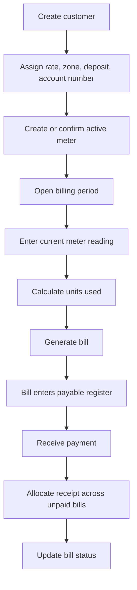

# Billing Workflow

This document describes the implemented billing workflow from customer setup through bills, penalties, payments, and recovery corrections.

## Core Concepts

- Customers belong to a rate and zone.
- Rates can have effective-dated tariff versions and tariff blocks.
- Billing periods define the accounting window.
- Meter readings generate bills.
- Payments allocate against payable bills.
- Corrections are allowed through controlled edit/review flows.

## Standard Billing Flow



## Bill Calculation

Basic bill logic:

```text
units_used = current_reading - previous_reading
amount = units_used * applicable tariff
```

The current implementation supports more than the original flat-rate MVP:

- Effective-dated rate versions.
- Tariff blocks.
- Billing periods.
- Penalties and waivers.
- Customer deposits.
- Opening balances and migration balance bills.
- Source-side billing review and promotion.

## Billing Period Rules

Billing periods are managed through `/api/billing/periods`.

Supported period behavior:

- Create periods with start, end, closing, and due-date behavior.
- Review billing period readiness.
- Update period status.
- Restrict corrections in closed or locked periods.
- Require audit reasons for corrections where applicable.

## Penalties

Penalty workflow:

1. Preview eligible penalty applications.
2. Apply penalties to eligible unpaid bills.
3. Waive penalty applications where business rules require.
4. Reapply waived penalties when needed.

Related endpoints:

- `GET /api/billing/penalties`
- `GET /api/billing/penalties/preview`
- `POST /api/billing/penalties/apply`
- `PATCH /api/billing/penalties/:id/waive`
- `PATCH /api/billing/penalties/:id/reapply`

## Source Billing Review

Source-side meter readings are not supposed to become payable automatically when entered first. The intended workflow is:

1. Client meter is the preferred billing source.
2. Source meter reading can be submitted when the customer meter is unavailable or questionable.
3. Source reading creates a source billing review request.
4. Admin reviews the request.
5. Approved source request creates a held bill.
6. Admin explicitly promotes the held bill for payment if it should enter collections.

This keeps the business decision visible instead of silently billing from backup source data.

## Payment Workflow

Payments are receipt-level records.

Payment behavior:

- User selects a customer.
- System shows unpaid balance.
- Receipt amount is validated.
- Payment allocates against oldest unpaid payable bills first.
- Payment allocations are recorded separately.
- Bill status updates to `unpaid`, `partial`, or `paid`.
- Receipts can be edited.
- Voided payments can move into suspense for reapplication or discard.

## Recovery And Corrections

Supported recovery workflows:

- Edit meter readings and recalculate affected bills.
- Edit payments and reapply allocations.
- Void payments into suspense.
- Reapply or discard suspense.
- Create customer adjustments.
- Close customer accounts with closure bills and settlement tracking.

## Business Risks To Test Carefully

- Editing a reading after payment has been received.
- Payments across multiple unpaid bills.
- Locked billing periods.
- Source billing promotion.
- Penalty waiver and reapplication.
- Customer closure with unpaid balances or deposits.
