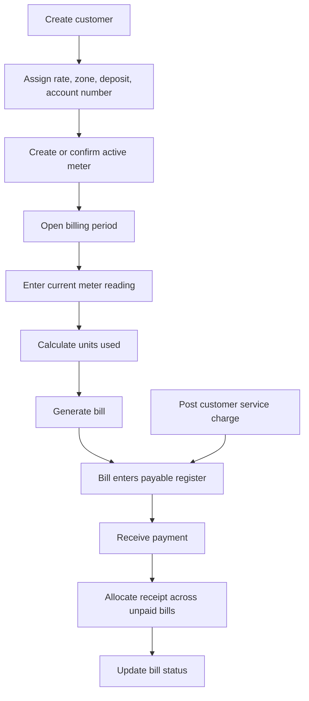

# Billing Workflow

This document describes the implemented billing workflow from customer setup through bills, penalties, payments, and recovery corrections.

## Core Concepts

- Customers belong to a rate and zone.
- Rates can have effective-dated tariff versions and tariff blocks.
- Billing periods define the accounting window.
- Meter readings generate bills.
- Customer service charges can generate payable service-charge bills.
- Payments allocate against payable bills.
- Corrections are allowed through controlled edit/review flows.

## Standard Billing Flow


```mermaid
flowchart TD
  A["Create customer"] --> B["Assign rate, zone, deposit, account number"]
  B --> C["Create or confirm active meter"]
  C --> D["Open billing period"]
  D --> E["Enter current meter reading"]
  E --> F["Calculate units used"]
  F --> G["Generate bill"]
  G --> H["Bill enters payable register"]
  L["Post customer service charge"] --> H
  H --> I["Receive payment"]
  I --> J["Allocate receipt across unpaid bills"]
  J --> K["Update bill status"]
```

## Bill Calculation

Basic bill logic:

```text
units_used = current_reading - previous_reading
amount = units_used * applicable tariff
```

The current implementation supports more than the original flat-rate MVP:

- Effective-dated rate versions.
- Tariff blocks.
- Billing periods.
- Penalties and waivers.
- Customer deposits.
- Opening balances and migration balance bills.
- Source-side billing review and promotion.
- Customer service charges for extra services such as meter replacement, reconnection, inspection, repair, water delivery, and admin fees.

## Billing Period Rules

Billing periods are managed through `/api/billing/periods`.

Supported period behavior:

- Create periods with start, end, closing, and due-date behavior.
- Review billing period readiness.
- Update period status.
- Restrict corrections in closed or locked periods.
- Require audit reasons for restricted-period corrections and for any close or lock override with unresolved readiness blockers.

## Guided Billing Cycle Control Surface

The Billing Cycle control surface brings the period-end work into one ordered operational flow. It is a control surface, not a replacement for the existing billing, reading, source-billing, bill, and invoice-delivery rules. Each step exposes the current state and routes the operator to the appropriate review work before the next irreversible action.

The intended flow is:

1. **Choose an open period.** Select the active billing period and confirm its dates, due date, status, and readiness summary before beginning work. Closed and locked periods remain visible for review but cannot be used to start a new billing run.
2. **Capture readings.** Record or import client-meter readings for the selected period. The operator can see missing-reading work, prior readings, validation failures, and the resulting bill count before committing a batch. The cycle shows a 95% reading-completion recommendation to pace bill preparation; it is guidance only and does not weaken the stricter close blockers.
3. **Resolve exceptions.** Clear reading exceptions such as missing, stale, duplicate, or decreasing readings. Review source-billing requests separately: a source-side reading remains a review item, an approved request creates a held bill, and promotion to a payable bill remains an explicit authorised decision.
4. **Issue and review bills.** Generate or review bills for valid readings, then inspect bill totals, usage, tariff results, and any held, voided, partial, or failed items before treating the period as ready.
5. **Inspect invoice delivery exceptions.** Review invoices that were not delivered, are pending retry, or have no usable delivery destination. Resolve the customer contact or delivery issue, then retry or record the appropriate follow-up; delivery exceptions must remain visible rather than being treated as successful delivery.
6. **Confirm readiness.** Use the readiness summary to identify unresolved readings, source-billing decisions, bill issues, and invoice delivery exceptions. Blocking conditions cannot be bypassed by a direct status request: a close or lock override requires a clear audit reason and saves the reviewed blocker snapshot.
7. **Close, then lock.** Close only when the period is operationally complete and the remaining exceptions have been deliberately handled. A reasoned override is an exception decision, not a resolution of the underlying work. Apply the existing audit-reasoned correction process for any permitted post-close work. Lock only after final review, because locking applies the stricter correction restrictions already enforced by the system.

### Operator Guardrails

- Work from one selected period at a time; do not mix readings, bills, or exceptions from different periods in the same review decision.
- Treat readiness counts as a queue for investigation. Where an exceptional close or lock is necessary, record why it is appropriate; the audit event retains the exact blocking evidence visible at that decision.
- Do not promote a held source-billing bill merely to remove it from an exception list; promotion determines whether it becomes collectible customer debt.
- Do not close or lock a period to hide unresolved delivery or billing work. Record and route exceptions through their existing correction, review, or follow-up process.
- Closure and locking preserve the existing safeguards: restricted corrections, required audit reasons where applicable, and stricter controls after lock.

## Penalties

Penalty workflow:

1. Preview eligible penalty applications.
2. Apply penalties to eligible unpaid bills.
3. Waive penalty applications where business rules require.
4. Reapply waived penalties when needed.

Related endpoints:

- `GET /api/billing/penalties`
- `GET /api/billing/penalties/preview`
- `POST /api/billing/penalties/apply`
- `PATCH /api/billing/penalties/:id/waive`
- `PATCH /api/billing/penalties/:id/reapply`

## Source Billing Review

Source-side meter readings are not supposed to become payable automatically when entered first. The intended workflow is:

1. Client meter is the preferred billing source.
2. Source meter reading can be submitted when the customer meter is unavailable or questionable.
3. Source reading creates a source billing review request.
4. Admin reviews the request.
5. Approved source request creates a held bill.
6. Admin explicitly promotes the held bill for payment if it should enter collections.

This keeps the business decision visible instead of silently billing from backup source data.

## Payment Workflow

Payments are receipt-level records.

Payment behavior:

- User selects a customer.
- System shows unpaid balance.
- Receipt amount is validated.
- Payment allocates against oldest unpaid payable bills first, including service-charge-backed bills.
- Payment allocations are recorded separately.
- Bill status updates to `unpaid`, `partial`, or `paid`.
- Receipts can be edited.
- Voided payments can move into suspense for reapplication or discard.

## Recovery And Corrections

Supported recovery workflows:

- Edit meter readings and recalculate affected bills.
- Edit payments and reapply allocations.
- Void payments into suspense.
- Reapply or discard suspense.
- Create customer adjustments.
- Post customer service charges as payable customer debt.
- Waive or cancel unpaid service charges with audit reasons.
- Close customer accounts with closure bills and settlement tracking.

## Business Risks To Test Carefully

- Editing a reading after payment has been received.
- Payments across multiple unpaid bills.
- Locked billing periods.
- Source billing promotion.
- Penalty waiver and reapplication.
- Customer closure with unpaid balances or deposits.
- Service charges that should be visible as customer payables but reported separately from normal water usage revenue.
