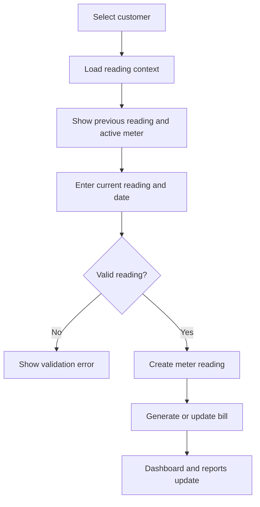

# Meter Reading Workflow

This document describes the customer meter, source meter, and production meter reading workflows.

## Customer Meter Reading Flow

## Reading Context

Before entry, the app exposes:

- Customer account and name.
- Active meter.
- Previous reading.
- Previous reading date.
- Rate and zone context.
- Billing period context.

This prevents blind data entry and helps catch abnormal consumption early.

## Reading Validation

Expected validation areas:

- Customer must exist and be active.
- Meter must be active.
- Reading date must be valid.
- Duplicate same-day customer readings should be prevented.
- Current reading should not create invalid negative consumption unless the workflow explicitly supports a correction or replacement.

## Meter Replacement

Meter replacement is tracked as an event instead of overwriting history.

Typical replacement flow:

1. Identify customer and old active meter.
2. Record old meter final reading.
3. Create or assign new meter.
4. Record new meter baseline.
5. Store replacement event with reason and actor.
6. Future readings use the new active meter.

This preserves continuity while avoiding false consumption jumps.

## CSV Reading Imports

Reading imports use a preview-then-commit pattern:

1. Upload CSV data for preview.
2. Validate rows.
3. Show rejected and accepted rows.
4. Commit only after review.

Related endpoints:

- `POST /api/readings/imports/preview`
- `POST /api/readings/imports/commit`

## Source Billing Workflow

Source-side readings support backup billing review.

Expected business rule:

- Client meter should be supplied first where available.
- Source meter reading should enter review.
- Source bill should remain held until promoted.
- Promotion is an explicit admin action.

## Production Reading Flow

Production monitoring uses source meters and weekly readings.

Production workflow:

1. Maintain production source meters.
2. Record weekly production readings.
3. Record electricity top-ups.
4. Compare production revenue against electricity cost.
5. Use dashboard and production reports for trend review.

Electricity top-ups create linked expense records for finance tracking.
