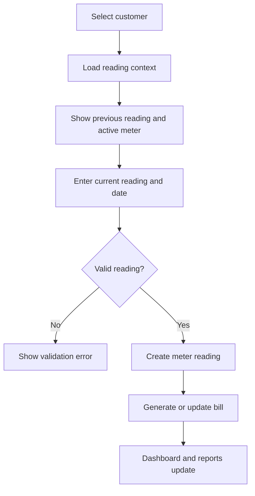

# Meter Reading Workflow

This document describes the customer meter, source meter, and production meter reading workflows.

## Customer Meter Reading Flow


```mermaid
flowchart TD
  A["Select customer"] --> B["Load reading context"]
  B --> C["Show previous reading and active meter"]
  C --> D["Enter current reading and date"]
  D --> E{"Valid reading?"}
  E -- "No" --> F["Show validation error"]
  E -- "Yes" --> G["Create meter reading"]
  G --> H["Generate or update bill"]
  H --> I["Dashboard and reports update"]
```

## Reading Context

Before entry, the app exposes:

- Customer account and name.
- Active meter.
- Previous reading.
- Previous reading date.
- Rate and zone context.
- Billing period context.

The single-reading form also accepts a meter-number lookup for accounts that are still eligible in the selected period. An exact typed, handheld-scanner, or compatible device-camera scan selects its customer and active meter; accounts with multiple active billing meters still require the operator to select the intended meter explicitly. Camera scanning stays optional and falls back to the typed lookup when browser support or camera access is unavailable.

This prevents blind data entry and helps catch abnormal consumption early.

## Reading Validation

Expected validation areas:

- Customer must exist and be active.
- Meter must be active.
- Reading date must be valid.
- Duplicate same-day customer readings should be prevented.
- Current reading should not create invalid negative consumption unless the workflow explicitly supports a correction or replacement.

## Meter Replacement

Meter replacement is tracked as an event instead of overwriting history.

Typical replacement flow:

1. Identify customer and old active meter.
2. Record old meter final reading.
3. Create or assign new meter.
4. Record new meter baseline.
5. Store replacement event with reason and actor.
6. Future readings use the new active meter.

This preserves continuity while avoiding false consumption jumps.

## CSV Reading Imports

Reading imports use a preview-then-commit pattern:

1. Upload CSV data for preview.
2. Validate rows.
3. Show rejected and accepted rows.
4. Commit only after review.

Related endpoints:

- `POST /api/readings/imports/preview`
- `POST /api/readings/imports/commit`

## Batch Reading Sheet

The Batch Reading Sheet removes the spreadsheet round trip for routine month-end entry while retaining the same import controls.

1. Load active customers who are still missing a reading for the selected month.
2. Filter by account, customer, zone, or meter.
3. Enter current readings and optional notes directly in the table.
4. Use `Enter`, `Arrow Down`, or `Arrow Up` to move between reading inputs; `Tab` follows the normal form order.
5. Review calculated usage and correct readings below the previous value.
6. Preview the entered rows. The server revalidates customer, meter, period, duplicate, and reading-sequence rules.
7. Confirm the validated batch to create readings and applicable bills in one transaction.

Blank rows are not submitted. Accounts with multiple active client-billing meters are excluded from inline entry and must use the single-reading form so the operator selects the intended meter explicitly. The sheet is saved on the current device for the active user and workspace, including across browser restarts. When offline, entered readings remain saved locally; reconnect before previewing or importing because server validation and bill creation are never queued automatically.

## Reading Anomaly Review

The Meter Readings workspace includes a read-only anomaly queue for client-billing meters. For each reading in the selected month, it compares interval usage with the average of the three preceding intervals and queues the reading when the variance is greater than 50 percent.

- New or replaced meters remain outside the queue until they have three earlier intervals.
- Source and shared monitoring meters remain in their dedicated review workflows.
- Opening **Review reading** only loads the existing correction form; it does not change a reading, bill, or billing period.
- Any correction continues through the existing audited reading update workflow.

Related endpoint:

- `GET /api/readings/anomalies?period_start=YYYY-MM-DD`

## Estimated Reading Candidates

Operators can load a suggested reading into the normal reading review form. The value is never posted automatically: verify it in the field, adjust it where needed, and submit through the standard billing-safe reading flow.

For missing client-meter readings, the workspace can suggest a verification value using the average of the three most recent completed usage intervals. This is an operational follow-up list, not an automatic estimation process: it never creates a reading, bill, audit event, or billing period.

- Candidates require an active client-billing meter, an active customer, exactly three earlier usage intervals, and no reading for that meter in the selected month.
- The suggested value is the latest cumulative reading plus the three-interval average usage.
- Operators must verify the field value and use the normal reading workflow for any approved entry.

Related endpoint:

- `GET /api/readings/estimation-candidates?period_start=YYYY-MM-DD`

## Source Billing Workflow

Source-side readings support backup billing review.

Expected business rule:

- Client meter should be supplied first where available.
- Source meter reading should enter review.
- Source bill should remain held until promoted.
- Promotion is an explicit admin action.

## Production Reading Flow

Production monitoring uses source meters and weekly readings.

Production workflow:

1. Maintain production source meters.
2. Record weekly production readings.
3. Record electricity top-ups.
4. Compare production revenue against electricity cost.
5. Use dashboard and production reports for trend review.

Electricity top-ups create linked expense records for finance tracking.

## Production Reading Context

The production weekly reading form loads context for the selected reading date:

- Previous prepaid kWh balance.
- Date that previous kWh balance was recorded.
- Previous reading per active production meter.
- Date of each previous meter reading.

This is exposed through:

```text
GET /api/production/reading-context?reading_date=YYYY-MM-DD
```

The context is informational. It helps operators enter Monday weekly readings without changing the underlying calculation model.

## Production Report Printing

Production reports support two print modes:

- Full production report: each week prints as a summary block followed by meter detail rows.
- Weekly summary print: keeps the summary-only row layout.

Full report meter detail rows include:

- Week
- Meter
- Previous reading
- Current reading
- Consumption
- Revenue

The production print surface is hidden during normal screen use and only appears when printing.
