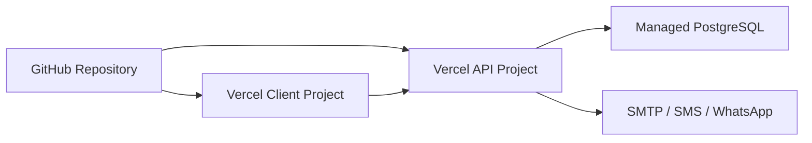

# Deployment Steps

The recommended deployment uses two Vercel projects from the same repository and one managed PostgreSQL database.

## Deployment Topology



## Prerequisites

- GitHub repository connected to Vercel.
- Managed PostgreSQL database.
- Production `DATABASE_URL`.
- Strong `JWT_SECRET`.
- Client and API project URLs.
- Optional provider credentials for SMTP, SMS, and WhatsApp.

## Database Setup

For a new database:

1. Create the production database.
2. Import `server/database/schema.sql`.
3. Import `server/database/seed.sql`.
4. Run `npm.cmd run db:migrate:baseline` once if the imported schema already includes the current migration set.
5. Log in and rotate seeded/demo passwords.

For an existing database:

1. Back up the database first.
2. Run `npm.cmd run db:migrate:status`.
3. Run `npm.cmd run db:migrate`.
4. Run smoke tests before deploying dependent API code.

## API Vercel Project

Project settings:

```text
Root Directory: server
Install Command: npm install
Build Command: None
Output Directory: None
Start Command: npm start
```

Required environment variables:

```text
DATABASE_URL=postgres://...
DATABASE_SSL=true
JWT_SECRET=<long-random-secret>
JWT_EXPIRES_IN=8h
SESSION_COOKIE_SECURE=true
SESSION_COOKIE_SAME_SITE=none
CRON_SECRET=<long-random-secret-for-vercel-cron>
AUTH_RATE_LIMIT_STORE=database
MONITORING_ALERT_EMAILS=<ops-email-list>
MONITORING_ALERT_PHONES=<optional-ops-sms-list>
CLIENT_ORIGIN=https://<client-project>.vercel.app
LOGO_STORAGE_MODE=data-url
```

For public client subdomains, use a comma-separated origin list:

```text
CLIENT_ORIGIN=https://www.example.com,https://status.example.com,https://docs.example.com
```

Health check:

```text
https://<api-project>.vercel.app/api/health
```

Expected response:

```json
{
  "status": "ok",
  "service": "agua-global-api"
}
```

Status check with database connectivity:

```text
https://<api-project>.vercel.app/api/status
```

## Client Vercel Project

Project settings:

```text
Root Directory: client
Framework Preset: Vite
Install Command: npm install
Build Command: npm run build
Output Directory: dist
```

Required environment variable:

```text
VITE_API_URL=https://<api-project>.vercel.app/api
```

## Optional Public Subdomains

The client app can serve public utility pages from the same Vercel project:

```text
status.<domain> -> status page
docs.<domain>   -> documentation hub
```

Add the subdomains to the client Vercel project, configure DNS using Vercel's instructions, then add those origins to the API project's `CLIENT_ORIGIN` list. Direct paths such as `/status` and `/docs` are also supported for local checks.

## Post-Deployment Checklist

- API health endpoint responds.
- Client loads without console API base URL errors.
- Login works for admin.
- Temporary passwords are changed.
- Dashboard loads.
- Customer list loads.
- Reading can be entered.
- Bill is generated.
- Payment can be posted.
- Receipt can be viewed or sent.
- Customer portal login works.
- Production and payroll pages load for authorized users.
- Communications page shows configured provider state.
- Business Settings > Application Monitoring loads and shows API/database status.
- Admin monitoring test alert runs without errors after alert recipients are configured.
- Business Settings restore drill ledger can record a staging restore result.
- Business Settings > Print Page Defaults saves and a bill/receipt print dialog opens with the expected page setup.
- CORS is correct: `CLIENT_ORIGIN` includes every frontend origin that calls the API.

## Release Discipline

- Run `npm.cmd run build` in `client/` before deploying.
- Run `node --check` or targeted syntax checks on changed server files.
- Apply database migrations before deploying code that depends on them.
- Document every migration and behavior change in `docs/12-implementation-records.md`.

Use the release helper for a repeatable Vercel preflight:

```powershell
.\scripts\vercel-release-check.ps1
```

If PowerShell blocks local scripts, use a process-scoped bypass:

```powershell
powershell -ExecutionPolicy Bypass -File .\scripts\vercel-release-check.ps1
```

The default run is a dry run. It checks Git status, audits server/client dependencies, runs targeted server syntax checks, and builds the client. It only runs smoke tests when `TEST_DATABASE_URL` is set.

For a production-oriented check after loading the API project's production environment variables locally:

```powershell
$env:AGUA_API_URL = "https://<api-project>.vercel.app/api"
$env:AGUA_CLIENT_URL = "https://<client-project>.vercel.app"
.\scripts\vercel-release-check.ps1 -Production
```

To deploy through a linked Vercel CLI project after the checks pass:

```powershell
.\scripts\vercel-release-check.ps1 -Production -Deploy
```

Do not use `-Deploy` unless the linked Vercel project and loaded environment variables are the intended production target.

## Current Migrations

Use the tracked migration runner for all schema changes:

```powershell
cd server
npm.cmd run db:migrate:status
npm.cmd run db:migrate
```

## Application Monitoring

Application Monitoring is available from Business Settings for admin, accountant, and business viewer users. It records server-side API failures, database status failures, failed login attempts, and authenticated client page crashes.

Run `npm.cmd run db:migrate` before deploying code that depends on this panel. The public status endpoint remains:

```text
GET https://<api-project>.vercel.app/api/status
```

It should return `database: "ok"` when the API can reach PostgreSQL.

Monitoring alert cron is configured in `server/vercel.json`:

```text
0 5 * * * -> /api/monitoring/cron
```

Set `MONITORING_ALERT_EMAILS` and/or `MONITORING_ALERT_PHONES` to receive alerts. `MONITORING_CRON_SECRET` can override `CRON_SECRET` for this endpoint.

Vercel Hobby projects cannot run cron jobs more frequently than once per day. For frequent monitoring, configure an external uptime service to call:

```text
GET https://<api-project>/api/monitoring/cron
Authorization: Bearer <MONITORING_CRON_SECRET-or-CRON_SECRET>
```

Use a 15-minute interval externally if you want near-real-time alerting without upgrading the Vercel plan.

## Scheduled Operational Reminders

Operational reminder emails can be sent manually from Business Settings or by a scheduler.

```text
GET https://<api-project>.vercel.app/api/reminders/operational/cron
Authorization: Bearer <CRON_SECRET>
```

The endpoint skips duplicate reminder type/recipient sends for the same day. It also accepts a comma-separated `types` query so reminder groups can run at different times when using an external scheduler:

```text
Morning operational run:
GET /api/reminders/operational/cron/operations

Midday readings run:
GET /api/reminders/operational/cron/readings
```

The API project's `server/vercel.json` defines one Hobby-compatible daily job:

```text
0 6 * * * -> /api/reminders/operational/cron
```

Timing uses East Africa Time; Vercel cron expressions are UTC, so 9:00 AM EAT is `0 6 * * *`. Use an external scheduler for a separate midday readings run if needed.

Locally or on a persistent server, the equivalent command is:

```powershell
cd server
npm.cmd run ops:reminders
```

Selected groups can be run with:

```powershell
cd server
npm.cmd run ops:reminders -- --types=meter_readings,weekly_production_readings
```

If a deployment database is behind, bring it current with:

```powershell
npm.cmd run db:migrate
```
