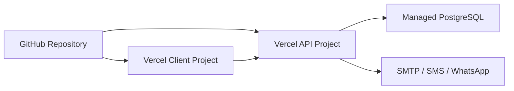

# Deployment Steps

The recommended deployment uses two Vercel projects from the same repository and one managed PostgreSQL database.

## Deployment Topology



## Prerequisites

- GitHub repository connected to Vercel.
- Managed PostgreSQL database.
- Production `DATABASE_URL`.
- Strong `JWT_SECRET`.
- Client and API project URLs.
- Optional provider credentials for SMTP, SMS, and WhatsApp.

## Database Setup

For a new database:

1. Create the production database.
2. Import `server/database/schema.sql`.
3. Import `server/database/seed.sql`.
4. Run migrations that are not already incorporated into the imported schema.
5. Log in and rotate seeded/demo passwords.

For an existing database:

1. Back up the database first.
2. Apply migrations in numeric order.
3. Run smoke tests before deploying dependent API code.

## API Vercel Project

Project settings:

```text
Root Directory: server
Install Command: npm install
Build Command: None
Output Directory: None
Start Command: npm start
```

Required environment variables:

```text
DATABASE_URL=postgres://...
DATABASE_SSL=true
JWT_SECRET=<long-random-secret>
JWT_EXPIRES_IN=8h
CLIENT_ORIGIN=https://<client-project>.vercel.app
LOGO_STORAGE_MODE=data-url
```

Health check:

```text
https://<api-project>.vercel.app/api/health
```

Expected response:

```json
{
  "status": "ok",
  "service": "agua-global-api"
}
```

## Client Vercel Project

Project settings:

```text
Root Directory: client
Framework Preset: Vite
Install Command: npm install
Build Command: npm run build
Output Directory: dist
```

Required environment variable:

```text
VITE_API_URL=https://<api-project>.vercel.app/api
```

## Post-Deployment Checklist

- API health endpoint responds.
- Client loads without console API base URL errors.
- Login works for admin.
- Temporary passwords are changed.
- Dashboard loads.
- Customer list loads.
- Reading can be entered.
- Bill is generated.
- Payment can be posted.
- Receipt can be viewed or sent.
- Customer portal login works.
- Production and payroll pages load for authorized users.
- Communications page shows configured provider state.
- CORS is correct: `CLIENT_ORIGIN` exactly matches frontend origin.

## Release Discipline

- Run `npm.cmd run build` in `client/` before deploying.
- Run `node --check` or targeted syntax checks on changed server files.
- Apply database migrations before deploying code that depends on them.
- Document every migration and behavior change in `docs/12-implementation-records.md`.

## Current Late-Stage Migrations

The late-stage operational migrations include:

```powershell
cd server
npm.cmd run db:migrate:hold-source-backup-bills
npm.cmd run db:migrate:supporting-documents
npm.cmd run db:migrate:contractor-invoices
npm.cmd run db:migrate:user-access-profiles
```

If a deployment database has not yet received production meter replacement, maintenance expense links, or portal customer links, also run:

```powershell
node src/db/runSqlFile.js database/migrations/035_production_meter_replacement.sql
node src/db/runSqlFile.js database/migrations/036_maintenance_expense_links.sql
node src/db/runSqlFile.js database/migrations/037_portal_user_customer_links.sql
```
