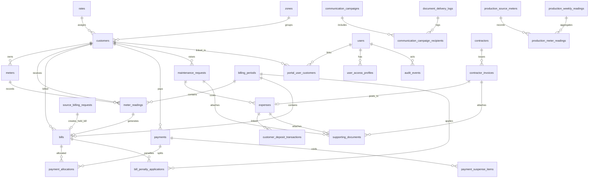

# Database Schema Diagram

The database is PostgreSQL. The base schema is in `server/database/schema.sql`; later feature additions are in `server/database/migrations/`.

## Major Entity Relationship Diagram

## Core Tables

Customer and setup:

- `customers`
- `rates`
- `rate_versions`
- `rate_version_blocks`
- `tariff_blocks`
- `zones`
- `users`
- `user_access_profiles`
- `portal_user_customers`
- `password_reset_tokens`

Metering and billing:

- `meters`
- `meter_readings`
- `meter_events`
- `billing_periods`
- `billing_settings`
- `bills`
- `source_billing_requests`
- `bill_penalty_applications`

Payments and finance:

- `payments`
- `payment_allocations`
- `payment_suspense_items`
- `expenses`
- `customer_deposit_transactions`
- `customer_adjustments`

Operations:

- `maintenance_requests`
- `business_settings`
- `audit_events`
- `document_delivery_logs`
- `supporting_documents`
- `communication_campaigns`
- `communication_campaign_recipients`
- `communication_templates`

Production:

- `production_source_meters`
- `production_meter_events`
- `production_electricity_topups`
- `production_weekly_readings`
- `production_meter_readings`

Payroll, from migrations:

- `payroll_payees`
- `payroll_runs`
- `payroll_line_items`

Contractors, from migrations:

- `contractors`
- `contractor_invoices`

## Important Relationships

- A customer belongs to one rate and one zone.
- A customer may have many meters, but only one should be active for normal billing.
- A meter reading belongs to a customer, optional billing period, and optional meter.
- A bill belongs to a customer and can reference previous and current readings.
- A payment belongs to a customer and can allocate across many bills.
- A payment allocation links one payment to one bill.
- A source billing request represents a reviewed backup/source-meter bill decision.
- Maintenance requests can create linked expenses.
- Production electricity top-ups create linked expenses.
- Communication campaigns store bulk-send history and recipient results.
- Portal users are linked to customer records through `portal_user_customers`.
- Access profiles give a user one or more selectable operating contexts.
- Supporting documents attach files to maintenance requests, expenses, and contractor invoices.
- Contractor invoices can be reviewed and posted into expenses.

## Migration Note

The project currently uses numbered SQL files instead of a formal migration tracking table. This means production operators must know which migration files have been applied. The latest known migration is `041_user_access_profiles.sql`. Adding a migration ledger is a recommended hardening task.
