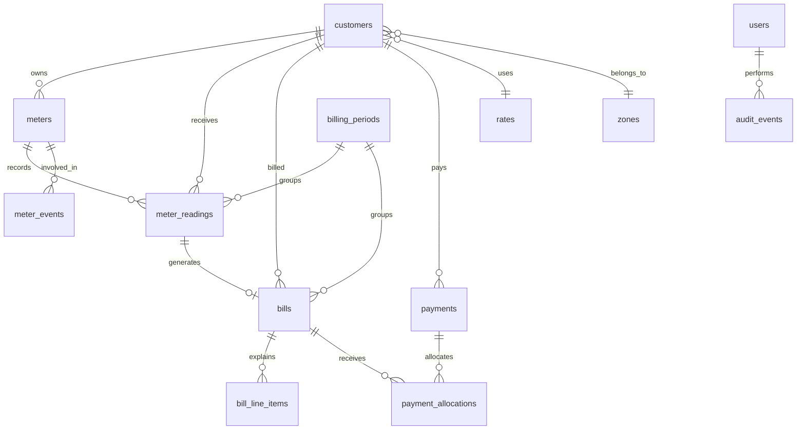

# Core Business Model

This document defines the shared model for the next AGUA Global core business layer. It covers build-order items 1-5: billing period rules, reading visibility, meter replacement, payments/receipts, and audit trail.

## Current Foundation

The app already has a practical starter model:

- `customers` own account details, zone, rate, status, and current balance can be derived from bills.
- `rates` store the current flat customer rate.
- `zones` behave as routes/locations for customers.
- `meter_readings` store customer readings and create bills.
- `bills` store consumption, amount, due date, paid amount, and status.
- `payments` store customer payments and allocate them to unpaid bills.
- `users` provide actor identity and role-based access.

The next model should keep this foundation, but add explicit business-control records so billing, meter lifecycle, payments, and audits are predictable.

## Current Gaps To Close

These are the specific gaps found in the current schema and controllers:

- Billing due dates are hard-coded as reading date plus 14 days.
- There is no explicit billing period record, so monthly close, lock, and reporting rules are implied instead of controlled.
- Readings belong only to customers, not physical meters.
- Previous reading is calculated during bill creation, but not exposed as a reading-entry aid or stored on the reading itself.
- Meter replacements cannot be represented without rewriting or confusing reading history.
- Payments are currently split into one `payments` row per bill allocation, so the receipt is not a first-class record.
- Payment methods and references exist, but receipt numbers, M-Pesa/paybill references, and reconciliation status are not explicit.
- Sensitive changes are not audit logged.

## First-Version Business Defaults

These defaults keep the first implementation useful while leaving room for later policy changes:

- Billing cycle: one global monthly period for all customers.
- Billing period status flow: `draft` -> `open` -> `closed` -> `locked`.
- Due date: the last day of the month after the billed monthly period.
- Penalties: supported as a fixed/lump-sum charge, but disabled by default.
- Deposits: tracked on customers as paid or not paid, but not applied to bills except through a later termination workflow.
- Meter replacement: preserve old meter history, create a new active meter, and calculate future readings against the new meter.
- Mid-period replacement: store enough data to split usage later; first UI may summarize total consumption unless a split bill view is needed immediately.
- Payment allocation: oldest unpaid bills first unless a specific bill is selected.
- Overpayments: blocked for now until customer credit handling is intentionally designed.
- Audit trail: append-only JSON snapshots for create, update, delete, void, and status-change actions.

## Design Principles

- Keep billing explainable from the bill itself: period, readings, units, charges, due date, penalties, paid amount, and balance.
- Keep meter history separate from customer history so replacements do not erase prior readings.
- Keep payments as receipts plus allocations, because one payment may settle one or many bills.
- Keep audit logs append-only and generic enough to cover customers, readings, bills, payments, and settings.
- Keep tariffs simple in the UI for now, but store enough structure to support future blocks, fixed charges, VAT, fees, and exemptions.

## Relationship Map

## Proposed Core Entities

### Customers

Existing `customers` should remain the account owner.

Recommended additions:

- `deposit_amount NUMERIC(12,2) DEFAULT 0`
- `deposit_paid BOOLEAN DEFAULT FALSE`
- `deposit_paid_at DATE`
- `customer_type VARCHAR(40)` such as `domestic`, `commercial`, `institutional`
- `meter_id INTEGER` nullable pointer to the currently active meter, after the `meters` table exists

Business purpose:

- Deposits become visible business value rather than notes.
- Customer type prepares the tariff model without forcing advanced tariffs now.
- Active meter linkage allows replacements without losing the customer account.

### Billing Periods

New table: `billing_periods`

Suggested fields:

- `id`
- `name`, for example `May 2026`
- `period_start DATE`
- `period_end DATE`
- `closing_date DATE`
- `bill_date DATE`
- `due_date DATE`
- `status VARCHAR(20)` such as `draft`, `open`, `closed`, `locked`
- `created_by`
- `created_at`
- `updated_at`

Business purpose:

- Defines when a month is billed.
- Allows the business to close and lock a billing cycle.
- Gives reports and bills a consistent period instead of deriving everything from reading dates.

Initial rule recommendation:

- One global monthly billing period.
- Due date defaults to the last day of the following month.
- Route-specific billing can be added later by linking billing periods to zones.

Operational notes:

- `draft` means the period exists but is not ready for active reading entry.
- `open` means readings and bills can be posted.
- `closed` means normal posting should stop, but admin corrections can still happen.
- `locked` means changes require an explicit adjustment workflow and audit reason.

### Billing Settings

New table: `billing_settings`

Suggested fields:

- `id`
- `due_rule VARCHAR(40) DEFAULT 'next_month_end'`
- `penalty_grace_days INTEGER DEFAULT 0`
- `penalty_type VARCHAR(20)` such as `none`, `fixed`
- `penalty_value NUMERIC(12,2) DEFAULT 0`
- `deposit_required BOOLEAN DEFAULT FALSE`
- `default_deposit_amount NUMERIC(12,2) DEFAULT 0`
- `updated_by`
- `updated_at`

Business purpose:

- Gives the business one place to set billing behavior.
- Prevents penalty and due-date logic from being hard-coded in controllers.

### Meters

New table: `meters`

Suggested fields:

- `id`
- `customer_id`
- `meter_number`
- `installed_at DATE`
- `removed_at DATE`
- `initial_reading NUMERIC(12,2) DEFAULT 0`
- `status VARCHAR(20)` such as `active`, `replaced`, `removed`, `faulty`
- `notes TEXT`
- `created_at`
- `updated_at`

Business purpose:

- Separates the physical meter from the customer account.
- Allows the same customer to have a clean meter history.

### Meter Events

New table: `meter_events`

Suggested fields:

- `id`
- `customer_id`
- `old_meter_id`
- `new_meter_id`
- `event_type VARCHAR(30)` such as `install`, `replacement`, `removal`, `fault`
- `event_date DATE`
- `old_final_reading NUMERIC(12,2)`
- `new_initial_reading NUMERIC(12,2)`
- `reason TEXT`
- `created_by`
- `created_at`

Business purpose:

- Provides a clear, dispute-friendly trail for replacements.
- Lets billing calculate old-meter usage plus new-meter usage in the same period if needed.

Initial replacement rule recommendation:

- Record old final reading and new initial reading.
- Current reading entry should show the latest previous reading for the active meter.
- If replacement happens mid-period, bill old meter consumption up to final reading and new meter consumption from initial reading.

### Meter Readings

Existing `meter_readings` should remain, but should be linked to meters and periods.

Recommended additions:

- `meter_id INTEGER REFERENCES meters(id)`
- `billing_period_id INTEGER REFERENCES billing_periods(id)`
- `previous_reading_value NUMERIC(12,2)` snapshot for UI/billing clarity
- `previous_reading_id INTEGER REFERENCES meter_readings(id)`
- `source VARCHAR(30)` such as `field`, `admin`, `import`, `portal`
- `notes TEXT`
- `updated_by`
- `updated_at`

Business purpose:

- Makes previous reading visible and stored at input time.
- Allows reading history to survive meter changes.
- Supports future CSV import and customer portal submissions.

### Bills

Existing `bills` should remain the customer-facing invoice record.

Recommended additions:

- `billing_period_id INTEGER REFERENCES billing_periods(id)`
- `bill_number VARCHAR(80) UNIQUE`
- `subtotal_amount NUMERIC(12,2)`
- `penalty_amount NUMERIC(12,2) DEFAULT 0`
- `deposit_applied_amount NUMERIC(12,2) DEFAULT 0`
- `adjustment_amount NUMERIC(12,2) DEFAULT 0`
- `total_amount NUMERIC(12,2)`
- `balance_amount NUMERIC(12,2)`
- `issued_at TIMESTAMPTZ`
- `locked_at TIMESTAMPTZ`
- status values expanded to `draft`, `issued`, `partial`, `paid`, `overdue`, `void`

Business purpose:

- Separates base water charge from penalties, deposits, and adjustments.
- Allows bills to be issued and locked.
- Makes reports and customer portal views more reliable.

Initial rule recommendation:

- Keep `amount` as the water charge for compatibility.
- Add `total_amount` and `balance_amount` for new workflows.
- Generate bill numbers when bills are issued.

### Bill Line Items

New table: `bill_line_items`

Suggested fields:

- `id`
- `bill_id`
- `line_type VARCHAR(30)` such as `water_usage`, `penalty`, `deposit`, `adjustment`, `fee`, `tax`
- `description`
- `quantity NUMERIC(12,2)`
- `unit_price NUMERIC(12,2)`
- `amount NUMERIC(12,2)`
- `created_at`

Business purpose:

- Keeps bills explainable.
- Future-proofs fixed charges, VAT, reconnection fees, exemptions, and block tariffs.

Initial rule recommendation:

- Create one `water_usage` line item per bill.
- Add penalties and deposits as separate line items only when enabled.

### Payments

Existing `payments` should evolve into receipt-level payments.

Recommended additions:

- `receipt_number VARCHAR(80) UNIQUE`
- `payment_channel VARCHAR(30)` such as `cash`, `bank`, `mpesa_paybill`, `manual_adjustment`
- `external_reference VARCHAR(120)`
- `received_from VARCHAR(160)`
- `status VARCHAR(20)` such as `posted`, `void`
- `total_allocated_amount NUMERIC(12,2)`
- `voided_by`
- `voided_at`
- `updated_by`
- `updated_at`

Business purpose:

- Captures receipt identity and payment method clearly.
- Allows accountant reconciliation.
- Supports future M-Pesa/paybill integration.

### Payment Allocations

New table: `payment_allocations`

Suggested fields:

- `id`
- `payment_id`
- `bill_id`
- `amount NUMERIC(12,2)`
- `created_at`

Business purpose:

- One receipt can pay multiple bills.
- Bill payment history becomes easier to audit.
- Existing `payments.bill_id` can remain temporarily for compatibility, then be phased out.

Initial allocation rule recommendation:

- If no bill is selected, allocate to oldest unpaid bills first.
- If a bill is selected, allocate only to that bill.
- Do not allow overpayment until the business decides how credits should be handled.

### Audit Events

New table: `audit_events`

Suggested fields:

- `id`
- `actor_user_id`
- `action VARCHAR(80)`, for example `customer.updated`, `reading.created`, `payment.voided`
- `entity_type VARCHAR(60)`
- `entity_id INTEGER`
- `before_data JSONB`
- `after_data JSONB`
- `reason TEXT`
- `ip_address VARCHAR(80)`
- `user_agent TEXT`
- `created_at`

Business purpose:

- Tracks who changed sensitive records.
- Supports disputes, fraud checks, and management review.
- Works across all milestone 1-5 entities.

Initial audit rule recommendation:

- Audit creates, updates, deletes/voids for customers, readings, bills, payments, rates, billing settings, meters, and meter events.
- Store full JSON snapshots for simplicity and reliability.

## API And UI Impact

### Billing Periods

New API surface:

- `GET /api/billing/periods`
- `POST /api/billing/periods`
- `PATCH /api/billing/periods/:id/status`
- `GET /api/billing/settings`
- `PUT /api/billing/settings`

UI impact:

- Add a compact billing settings/period management view for admins/accountants.
- Readings screen should default to the current open billing period.
- Bills screen should filter by billing period.

### Reading Entry

API impact:

- `GET /api/readings/context?customer_id=&billing_period_id=` should return active meter, previous reading, and warnings.
- `POST /api/readings` should accept `billing_period_id`, `meter_id`, `reading_value`, `reading_date`, and optional notes.

UI impact:

- Customer selection should reveal active meter number, previous reading, previous reading date, and expected period.
- Current reading input should validate against the previous reading before submit where possible.

### Meter Replacement

New API surface:

- `GET /api/meters?customer_id=`
- `POST /api/meter-events/replacement`

UI impact:

- Add a replacement action from the customer or reading workflow.
- Replacement form captures old final reading, new meter number, new initial reading, date, and reason.

### Payments And Receipts

API impact:

- `POST /api/payments` should create one receipt row and one or many allocation rows.
- `GET /api/payments/:id` should return receipt, allocations, and affected bills.
- Existing payment listing should show receipt number, channel, external reference, and total amount.

UI impact:

- Payment form should use `payment_channel` values: `cash`, `bank`, `mpesa_paybill`, `manual_adjustment`.
- Reference label should adapt to the channel: receipt number, bank slip, M-Pesa transaction code, or adjustment note.
- Payment history should show one row per receipt, not one row per allocated bill.

### Audit Trail

API impact:

- Internal helper: `recordAuditEvent(client, actor, action, entityType, entityId, beforeData, afterData, reason, req)`.
- Later read API: `GET /api/audit-events?entity_type=&entity_id=`.

UI impact:

- No heavy UI needed in the first slice.
- Add lightweight audit history panels later on customer, bill, payment, and reading detail screens.

## Core Workflows

### 1. Billing Period Setup

1. Admin/accountant creates or opens a billing period.
2. System calculates `period_start`, `period_end`, `closing_date`, `bill_date`, and `due_date`.
3. Readings entered for the period link to that billing period.
4. Bills generated for the period link to that billing period.
5. Period can be closed or locked after review.

### 2. Reading Entry

1. User selects customer.
2. System displays active meter and previous reading.
3. User enters current reading and date.
4. System validates that current reading is not below previous reading for the same active meter.
5. System snapshots previous reading on the reading record.
6. System generates or recalculates the related bill.
7. System writes an audit event.

### 3. Meter Replacement

1. User opens replacement workflow for customer.
2. System displays current active meter and latest reading.
3. User records old final reading, new meter number, new initial reading, replacement date, and reason.
4. System marks old meter as `replaced`.
5. System creates new active meter.
6. System creates a meter event.
7. Future readings use the new meter.
8. Billing can include old and new meter consumption if the replacement falls inside the same billing period.

### 4. Payment Posting

1. Accountant selects customer or enters account number.
2. System displays open bills and total balance.
3. Accountant records amount, payment channel, reference, receipt number, and payment date.
4. System allocates payment to selected bill or oldest unpaid bills.
5. System updates bill balances/statuses.
6. System writes audit events for payment and affected bills.

### 5. Audit Logging

1. Sensitive action happens inside a database transaction.
2. Before and after snapshots are captured where applicable.
3. Audit event is inserted before commit.
4. UI can later show audit history by record.

## Implementation Slices

### Slice 1: Billing Periods And Settings

Database:

- Add `billing_periods`.
- Add `billing_settings`.
- Add `billing_period_id`, `bill_number`, `subtotal_amount`, `penalty_amount`, `deposit_applied_amount`, `adjustment_amount`, `total_amount`, `balance_amount`, `issued_at`, and `locked_at` to `bills`.
- Backfill existing bills into billing periods based on `billing_month`.

Backend:

- Replace hard-coded due date logic with billing settings.
- Link new bills to the current/open billing period.
- Keep `amount` and `paid_amount` working for compatibility.

Frontend:

- Add billing period visibility to bills.
- Add due date and balance columns if space allows.

### Slice 2: Meters And Previous Reading Context

Database:

- Add `meters`. Implemented in `server/database/migrations/003_meters_reading_context.sql`.
- Create one active generated meter for every existing customer.
- Add `meter_id`, `billing_period_id`, `previous_reading_id`, and `previous_reading_value` to `meter_readings`.
- Backfill readings to each customer's generated active meter.

Backend:

- Add reading context endpoint: `GET /api/readings/context?customer_id=&reading_date=`.
- Change reading creation and recalculation to use active meter history first.

Frontend:

- Show active meter, previous reading/date, and monthly billing period during reading entry.

### Slice 3: Meter Replacement

Database:

- Add `meter_events`. Implemented in `server/database/migrations/004_meter_replacement_events.sql`.
- Change reading uniqueness from customer/date to meter/date so old-meter final and new-meter initial readings can share the replacement date.

Backend:

- Add replacement endpoint wrapped in a transaction: `POST /api/meters/replace`.
- Mark old meter replaced and create new active meter.
- Record an old-meter final reading and a new-meter initial baseline reading.
- Recalculate/create the final old-meter bill when previous usage exists.
- Create a `meter_events` replacement log.

Frontend:

- Add meter replacement form/action to the readings workspace.
- Show replacement events in a meter event history table.

### Slice 4: Receipt-Level Payments

Database:

- Add receipt fields to `payments`. Implemented in `server/database/migrations/005_receipt_level_payments.sql`.
- Add `payment_allocations`.
- Backfill one allocation for each existing payment row.

Backend:

- Create one payment receipt and one or many allocation rows.
- Update bills from allocations.
- Reverse and reapply allocations when a receipt is edited.
- Keep old `payments.bill_id`, `method`, and `reference` populated temporarily for compatibility.

Frontend:

- Update payment channels to `cash`, `bank`, `mpesa_paybill`, and `manual_adjustment`.
- Capture receipt number, external reference, received-from, and notes.
- Show one payment history row per receipt with allocation count and bill numbers.

### Slice 5: Audit Trail

Database:

- Add `audit_events`. Implemented in `server/database/migrations/006_audit_events.sql`.

Backend:

- Add audit helper: `recordAuditEvent`.
- Log customer creates, updates, and deletes.
- Log reading creates/updates and bill creation/recalculation.
- Log bill status changes.
- Log payment receipt creates/updates and allocation snapshots.
- Log billing period and billing settings changes.
- Log meter replacement, new meter creation, replacement readings, and meter event creation.
- Expose audit endpoint: `GET /api/audit-events`.

Frontend:

- Add Audit Trail page for admins/accountants with actor, action, entity, snapshot summary, reason, and timestamp.

## Migration Strategy

Recommended implementation order:

1. Add `billing_periods`, `billing_settings`, and bill period fields.
2. Add `meters`, create one active meter per existing customer, and link existing readings.
3. Add previous-reading visibility fields to `meter_readings`.
4. Add payment receipt fields and `payment_allocations`.
5. Add `audit_events` and begin logging changes in each controller.

Compatibility notes:

- Preserve existing `customers.rate`, `bills.amount`, `bills.paid_amount`, and `payments.bill_id` during the first migration so current screens do not break.
- Introduce new fields gradually and update UI screens one workflow at a time.
- Avoid dropping old columns until the replacement screens and reports are stable.

## Compatibility Contract

During milestones 1-5, these existing fields should remain available to avoid breaking current screens:

- `customers.rate`
- `customers.location`
- `bills.billing_month`
- `bills.amount`
- `bills.paid_amount`
- `bills.status`
- `payments.bill_id`
- `payments.method`
- `payments.reference`

New code can write the richer fields while still maintaining these compatibility columns. Once reports, receipts, and portal views use the new model, the old fields can be reviewed for deprecation.

## Open Business Decisions

These decisions should be confirmed while implementing the relevant milestone:

- Should billing periods be global or per zone/route?
- Should billing periods be opened manually every month, or should the system auto-create the period when the first reading is posted?
- What fixed penalty amount should be enabled later, if any?
- What deposit amount should be required for new customers, if any?
- Should receipt numbers be manually entered, system generated, or both?
- Should overpayments be blocked or stored as customer credit?
- During meter replacement, should mid-period consumption be split on the bill or summarized as one line?

## Recommended Next Step

Start with Slice 1 because it gives every later workflow a stable monthly container:

- Add billing period and billing settings tables.
- Backfill existing May 2026 seeded bills into a `May 2026` billing period.
- Replace the hard-coded 14-day due date with last-day-of-next-month billing settings.
- Preserve the current bill-generation behavior so readings still create bills normally.
